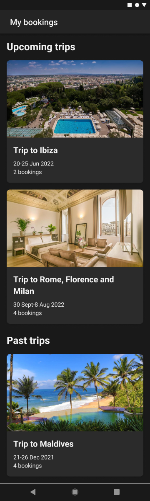
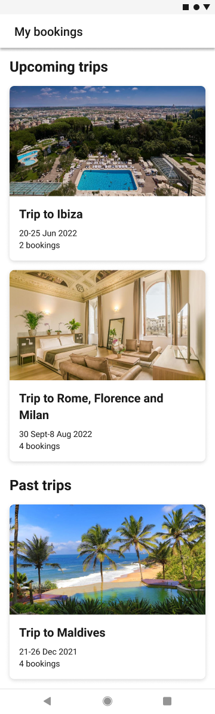
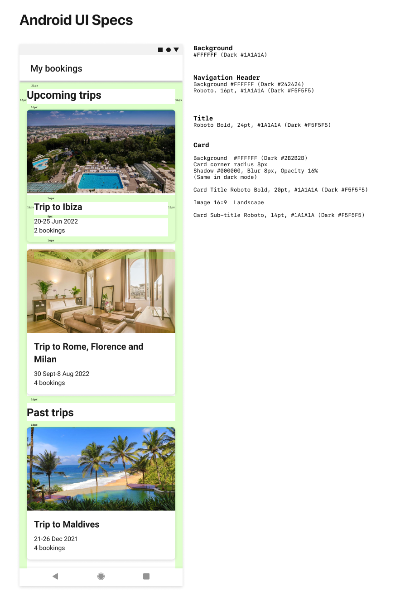

# Overview
To provide customers with a better experience during their trips, we analyse future bookings to identify variations of upcoming trips and present relevant services and options.

One of the patterns we look for are so-called "booking chains". A chain can consist of any number of bookings, as long as they are connected by their check-in and check-out dates. For example, in the simplest case of a chain with two bookings, the check-out date of the first booking is the same as the check-in date of the second booking.

In this task, we provide you with unordered sets of bookings and ask you to present them as a collection of ordered chains of bookings.

You should aim to spend between 2 to 3 hours on the task. This is a guideline rather than a hard-limit - don't panic to finish exactly on time, but try to provide the best solution that you can within the recommended time.

*Please feel free to ask if you have any questions after reading this document!*

# Task
## Requirements
Build an Android app based on the designs for the following screen:

**List of all the booking chains** - based on the provided set of bookings, compute all the existing chains and display them as a list with the following two sections:

- Upcoming trips - showing chains whose end date (i.e. check-out date of last booking in the chain) is in the future, listed in chronological order (most imminent trips shown first - i.e. next trip to take is at start of list)
- Past trips - showing chains whose end date is in the past, listed in reverse chronological order (most recent trips shown first - i.e. last trip taken is at start of list)

If a section would be empty, then it should not be shown.

For each chain in the list:
- The card should contain names of the booking locations (cities) in chronological order prefixed with "Trip to "
- If multiple consecutive bookings are in the same location, the name should be displayed only once
- Calculate and display the following for each chain
  - Start and end dates
  - Number of bookings in chain

You should test your solution using each of the user IDs that are listed in the section "Accessing test data" below, which return different sets of test bookings. Your solution does not need to handle edge cases such as overlapping chains of bookings.

Dark Mode            |  Light Mode
:-------------------------:|:-------------------------:
  |  



For the screen:

 - Implement loading, empty and error states
 - Test the UI in both dark and light mode

## What's provided
You are provided with the following in the repository that you cloned from HackerRank:

 - XML layouts for view components - you may need to tweak some things based on your approach
 - Light and Dark themes
 - Design specifications
 - Image loading and caching
 - BookingRepository and mock implementation which can return an array of test bookings (or an error). This is a mock service storing bookings against specific user IDs (see "Accessing test data" below)

## Accessing test data
The BookingRepository provides access to test bookings that allow you to test different sets of booking chains for various scenarios. To access them you can pass the following user IDs to the fetchBooking method - these correspond to different scenarios:

- *899848* will return a single chain occurring in the past and a single chain in the future (based on the current date)
- *48098* will return multiple chains occurring in the past and the future
- *8984747* will return a mixture of chains and bookings not associated with a chain
- *5678923* will return a list of bookings where none of the bookings are part of a chain

The service can also be made to return errors using the following user IDs, which correspond to different error scenarios:

- *99999* will return an empty list of bookings
- The service will return an error if called with a non-existent user id

## Examples
Here are examples to illustrate how a list of bookings can form one or more chains for some of these cases.

### Example 1: Single Chain
```
List of Bookings:

Booking(id=1, checkin=1, checkout=3),
Booking(id=2, checkin=3, checkout=5),
Booking(id=3, checkin=5, checkout=6)

Chains:
[1, 2, 3] make a chain.
``` 

### Example 2: Multiple Chains
```
List of Bookings:

Booking(id=1, checkin=1, checkout=3),
Booking(id=3, checkin=5, checkout=6)
Booking(id=2, checkin=3, checkout=5),
Booking(id=4, checkin=10, checkout=12),
Booking(id=5, checkin=12, checkout=13),
Booking(id=6, checkin=13, checkout=16)

Chains:
[1, 3, 2] and [4, 5, 6] are two chains
```

### Example 3: One chain + multiple single booking trips
```
List of Bookings:

Booking(id=1, checkin=1, checkout=3),
Booking(id=3, checkin=5, checkout=6)
Booking(id=2, checkin=3, checkout=5),
Booking(id=4, checkin=10, checkout=12),
Booking(id=5, checkin=14, checkout=15),

Chains:
[1, 3, 2] make a chain and [4] and [5] make single booking trips.
```

# How we evaluate
We want you to succeed! The aim of this task is to provide a foundation for the technical interview in the next stage of our recruitment process - this will be a discussion between you and your interviewers. As such, we're looking for you to create a solution that you are able to explain during the interview and can expand on when we add additional tasks or edge cases.

We will be looking for the following while reviewing and discussing your solution with you:

- **Completeness** - your solution meets the stated requirements
- **Efficiency** - your code performs well and the algorithms you implement consider time complexity
- **Architecture** - your solution should be well-structured with a clean architecture  and use suitable design patterns
- **Scalability** - your solution should be easily enhanced with changes in future and/or more potential screens
- **Code Style** - your code should have a consistent style and use a clear naming convention
- **Testability** - your solution should be designed for testability and we would like to see unit tests around your algorithm for creating booking chains
- **User Experience** - the UI is responsive, follows platform guidelines and provides a good user experience

## Tips
- The server is simulated inside BookingRepository, but the images are served from our Content Delivery Network (CDN)
- In terms of the quality of the code, our expectations are:
    - Design your code to be testable, even though you're not expected to write any unit tests as part of this exercise due to the given time constraints
    - Make the code adaptable to changing requirements
    - Write effective comments - imagine you need to understand the code in 6 months
- The code should be easy to compile, so avoid any unnecessary external dependencies

---
Thanks!

*- Booking Android community*
